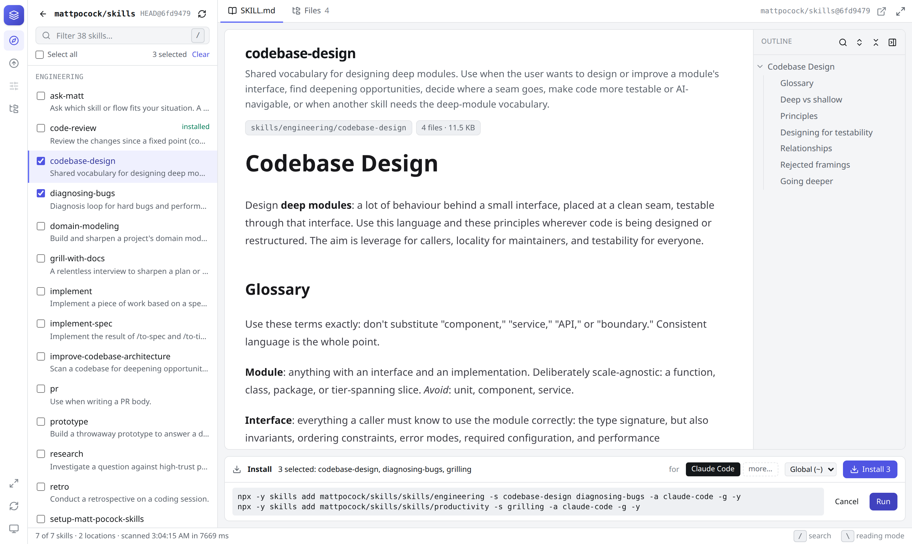
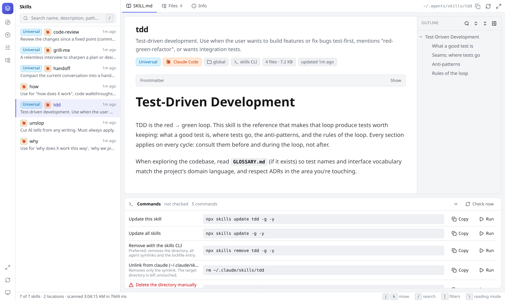

# Skills Manager

A local web app for the agent skills (`SKILL.md` folders) used by Claude Code, Codex, Cursor and other coding agents.

- **Find skills worth installing.** Search [skills.sh](https://skills.sh), or paste a GitHub repo such as `mattpocock/skills` or `https://github.com/cursor/plugins/tree/main/pstack/skills`. Read each skill before installing it, then tick only the ones you want.
- **See what you already have.** It scans every agent's skill directory (and any project folders you add), renders each `SKILL.md`, and works out how each skill was installed.
- **Keep them current.** Check for updates, then update or remove a skill with the right command for how it was installed.

Nothing changes on disk until you confirm. Every install, update or remove shows its exact command in a confirmation dialog first, and you can copy it into a terminal instead of running it from the app. Everything the app runs is kept in a command log.





## Features

- **Discover** (the compass in the rail): search [skills.sh](https://skills.sh), or paste a GitHub repository or subdirectory URL (`mattpocock/skills`, `https://github.com/cursor/plugins/tree/main/pstack/skills`) to list every skill in it. Preview each skill's `SKILL.md` and files before installing. Executable scripts are flagged. Tick the skills you want (with nothing ticked, Install takes the skill on screen), pick the agents and a scope (global or a project folder), and install them through the `skills` CLI (`npx skills add <owner>/<repo>/<dir>[#ref] -s <names…> -a <agents> [-g] -y`). Install asks once, showing the command it will run. Before running, the app checks that the branch still points at the commit you previewed. Repositories are read through the GitHub API at a pinned commit. Set `GITHUB_TOKEN`, or log in with `gh`, for private repos or if you hit the anonymous rate limit.
- Scans global skill directories for Claude Code, Codex, Cursor, Gemini CLI, Copilot, Windsurf, Kiro, OpenCode, Amp, Goose, Cline, Roo Code, the universal `.agents/skills` folder, and Claude Code plugins. Project folders can be added from the UI (or via `SKILLS_MANAGER_ROOTS`).
- Skills that are symlinked into several agent directories are shown once, with every location listed.
- Rendered `SKILL.md` (GitHub-flavoured markdown, syntax-highlighted code, collapsible frontmatter) with a heading outline, plus a file browser for everything else in the skill (scripts, references, assets). The file tree can be hidden to give a script or reference file the full width. Relative links in the markdown open the target file.
- Update and remove commands sit in a **Commands** panel under the document, collapsed by default so the document keeps the space. Its **Remove** button is always visible: it opens a dialog showing the command it will run (and the alternatives, such as unlinking only, when there are several), and one click confirms. Each command in the panel can also be copied, or run through the same dialog. The command and then its output appear in a panel over the document. The server only runs commands it generated for that skill, one at a time, and refuses cross-origin requests. The **Info** tab explains how the skill was installed and whether it is current.
- Install-method detection and tailored commands:

  | Detected as | How it's recognised | Remove | Update |
  |---|---|---|---|
  | `skills` CLI | entry in `~/.agents/.skill-lock.json` or a project's `skills-lock.json` | `npx skills remove <name> -y` | `npx skills update <name> -g -y` (or `-p` in a project) |
  | npm / pnpm / yarn / bun package | skill lives under `node_modules/<pkg>` | `<pm> remove <pkg>` | `<pm> update <pkg>` |
  | Claude Code plugin | inside `~/.claude/plugins` | `claude plugin uninstall …` | `claude plugin update …` |
  | Codex built-in | `~/.codex/skills/.system` | not recommended | upgrade the Codex CLI |
  | git clone | a git repo cloned into the skills dir | `rm -rf …` | `git pull --ff-only` |
  | symlink → git repo | link into a local checkout | `rm <link>` | `git -C <repo> pull --ff-only` |
  | plain symlink / manual copy | anything else | `rm …` | — |

- Update checks (on demand, cached for 5 minutes):
  - git: `git ls-remote` against the tracked branch, no fetch, no working-tree changes
  - npm: installed version vs. the registry `latest`
  - `skills` CLI: latest upstream commit touching the skill's path (GitHub API) vs. the install time in the lockfile
- Reloading: switching back to the app's window rereads the skill directories and the open file, so edits made in an editor or terminal show up on their own. The refresh button in the rail (or `r`) does the same on demand. Update check results survive a reload until that skill's install changes (a new commit, version or lockfile entry).
- Codex's bundled skills (`~/.codex/skills/.system`) are hidden by default. Pick the "Built-ins" quick filter above the list, flip the "Hide Codex built-ins" switch in the filters panel, or click "show" in the status bar to see them. The choice is remembered.
- Quick filters above the list (All, Attention, Symlinked, Plugins, Built-ins); the full filters (agent, scope, install method, update status) and the scanned locations open from the rail or with `[`.
- Light, dark and system theme.
- Reading mode (the expand icon in the rail or tab strip, or `\`): hides the filters panel and the skill list so the document takes the width. Remembered across reloads; `/` brings the list back with the search box focused.
- The heading outline sits beside the document on wide panes and opens as a popover on narrow ones.
- **Command log** (the clock in the rail): every install, update and remove the app has run, newest first, with its command, full output, exit status and duration. It is kept in `~/.config/skills-manager/command-log.jsonl` (the newest 200 runs, each with the end of its output, up to about 32,000 characters).
- Keyboard: `/` focuses search, `j`/`k` (or the arrow keys) move through the list, `\` toggles reading mode, `[` toggles the filters panel, `r` reloads from disk.

## Running

```bash
pnpm install
pnpm dev          # API on http://127.0.0.1:5178, UI on http://localhost:5173
```

Production build:

```bash
pnpm build
pnpm start        # serves the built UI + API on http://127.0.0.1:5178
```

Environment variables:

| Variable | Purpose |
|---|---|
| `PORT` | API / production port (default `5178`) |
| `HOST` | bind address (default `127.0.0.1`; the app exposes local file contents and can run install commands, keep it loopback) |
| `SKILLS_MANAGER_ROOTS` | extra project roots to scan, `:`-separated |
| `GITHUB_TOKEN` / `GH_TOKEN` | optional, used when anonymous GitHub requests are rate limited or the repo is private (falls back to `gh api`) |

Project roots added in the UI are stored in `~/.config/skills-manager/config.json`.

## Layout

```
server/   Hono API: scanner, install-method detection, update checks, GitHub/skills.sh discovery, command runner
shared/   Types shared between server and client
src/      React + Tailwind v4 UI
```

## Dependencies

All direct dependencies were audited before installation (registry metadata, maintainers, publish cadence, install scripts, `npm audit`, tarball spot checks). Build scripts are restricted to `esbuild` via `pnpm-workspace.yaml`, and `rolldown` is pinned to a release with soak time.
